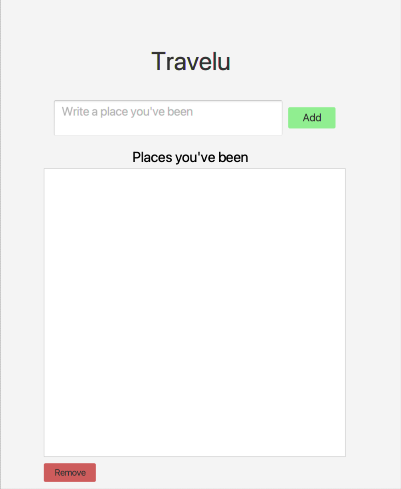
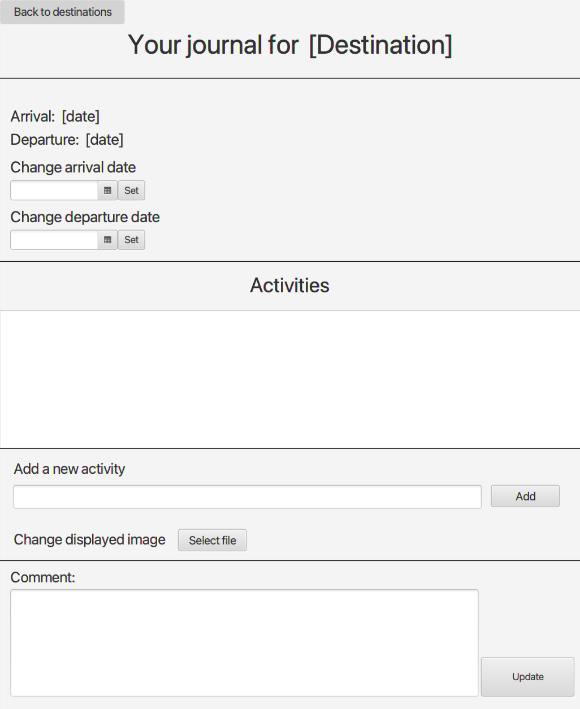

# Documentation release 1

## Current functionality of the project
Since this is the first release, we prioritized making an application that is interactive and visual. 

The application first consists of a list of destinations. You can add different destinations to the list by writing them down in the textbox and clicking on the “add"-button. It is also possible to remove each designated destination using the “remove"-button. The destinations in the list will be saved whenever you add or remove a destination from the list. If you close and reopen the app, the list will be the same as when you closed it.

You can double-click on each destination to get to a window where you can describe your visit. In future releases you will be able to write a detailed description of your trip, along with a rating, date, and activities.  
**Note:** This functionality will be added in a later release

### Screenshots of UI for release 1: 
Front page           |  Destination page
:-------------------------:|:-------------------------: 
  | 

## Sprint 1 - Planning the project

### Meeting 1 - Coop-contract
The very first meeting with the team was spent writing the coop-contract.  

### Meeting 2 - Choosing Project
In the second meeting we discussed several potential projects and decided to make a travel-journal application. Our argumentation for this choice is that this is both something we saw a need for, it is easy to come up with new features and it covers all the guidelines from the course-team.  
We also decided on guidelines for using git:
https://www.conventionalcommits.org/en/v1.0.0/

### Meeting 3 - Planning Sprint 1
In the third meeting we created a backlog and made a plan for the sprint regarding release 1. Here we divided the assignment given to us into smaller subtasks. Then we created an issue for each substask. This made it possible for us to have an organized and clearly defined plan of what we needed to do to complete sprint 1. From the description of group assignment 1 we created 26 issues regarding frontend, backend, and documentation with defined importances. We planned to at least complete all of the tasks marked with "high priority" by the end of the sprint. For instance, we decided to delay fully implementing the controller for the destination view. Right now, this is a shell without functionality, but this will be implemented in later releases.

The end of the sprint was set as the deadline for the group assignment. To be able to complete these tasks we decided to assign the issues evenly across the members of the group. We also arranged three meetings before the end of the sprint where we were going to develop together and go through what each member had done individually since the last meeting.

By clearly defining what we were going to do, how we were going to do it and distributing the tasks evenly across the members of the group, we were now ready to start development.

We also made a conceptual model to make sure we had the same underlying intetions of the applications design. The conceptual model makes the basic functionality of the system clear. By having a model that relates to the users' mental model, we make it easier to explain our intentions with the app.

#### Conceptual Model

### Meeting 4 - Tying things together
While we were approaching the end of sprint 1, we decided to have a final meeting to complete the remaining tasks and polish the project before delivery. Here we cleaned our code and rewrote parts of the documentation.

We also figured that the complexity of the app was just going to increase over time and wanted to assure that everyone had a clear understadning of the system we had built so far. We therefore decided to make a UML class diagram of our project to have a clear representation of what role every class played in the system. By designing a UML class diagram, we made it clear for all members of the group what every class does and how the classes relates to each other. This ensures that all members understand the structure of the project which will help development get more organized and efficient later on. There are a lot of different diagrams that help memebers get a quick overview of the project structure. However, we were looking for a way of giving a good understanding of the classes, methods and how they were all connected. For this purpose, a UML class diagrams is the superior option.

#### UML Class Diagram
