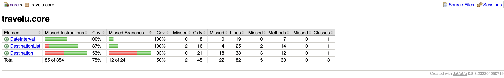

# Test Coverage with JaCoCo

[JaCoCo](https://www.jacoco.org/jacoco/), short for Java Code Coverage, is tool used for analyzing test coverage of code.  

Note that JaCoCo check whether code is executed.  
This mean that even though there are 100% test-coverage and success, not every part of the code is tested good enough or correctly.

## Running
- `cd travelu` if necessary
- `mvn verify` run appropriate lifecycle for checkstyle
- `mvn install` will also run `verify` phase

## The report
There are several ways to view the report:

### In-terminal
Run `mvn jacoco:report` to get an in-terminal shorthand run and report.

### In your browser
In the respective module: `target/site/jacoco/index.html`  

### The executable
JaCoCo generates an executable which can be used for viewing the report.  

Note that this functionality not yet is implemented and can therefore be ignored.
The report can either be viewed by using the executable generated. There are currently not implemented support for this.

## Report Example

## Sources
- [JaCoCO homepage](https://www.jacoco.org/jacoco/)  
- [Baeldung tutorial](https://www.baeldung.com/jacoco)
